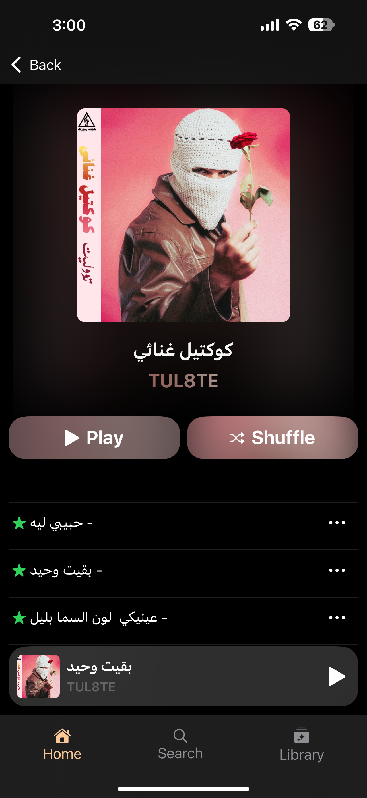
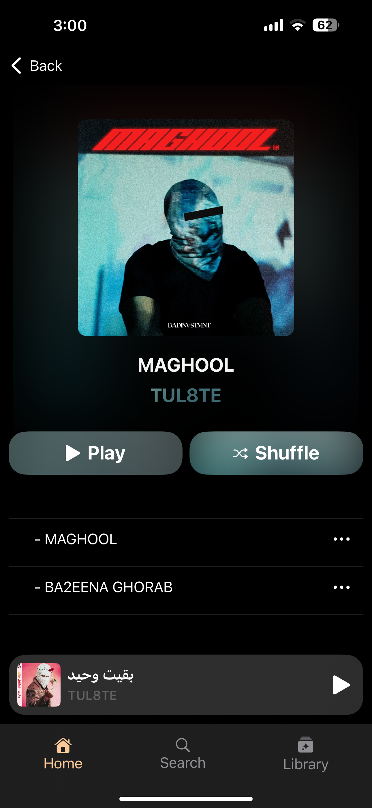
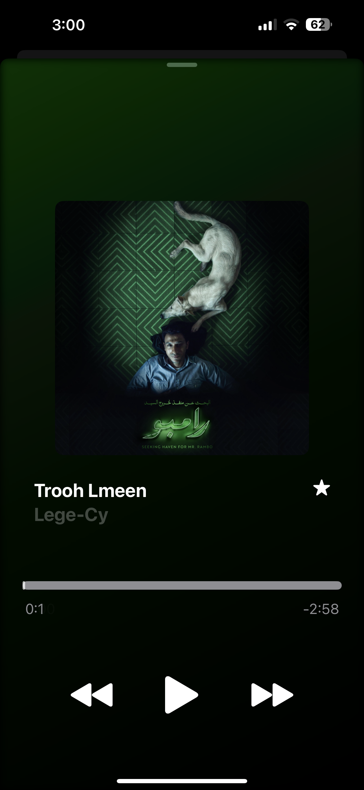
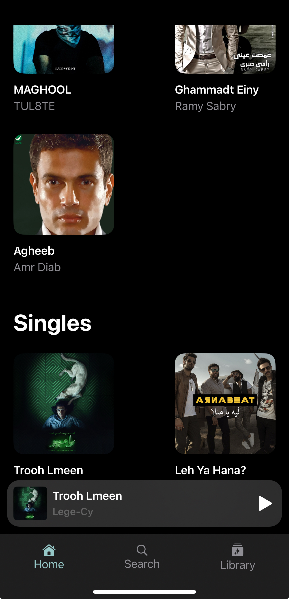

# 🎵 MusicPlayer App

A modern, immersive SwiftUI music player that goes beyond the basics. Built with a focus on user experience, real-time audio handling, custom design elements, and dynamic visual theming based on album artwork.

---

## ✨ Features

- 🎧 **Full Audio Playback**  
  Play, pause, and navigate through music using `AVAudioPlayer`, with real-time timer sync and slider control.

- 🖼️ **Dynamic Theming from Album Art**  
  Automatically extract dominant colors from album images using custom image processing, and use them to theme the UI.

- 🕹️ **Custom Interactive Slider**  
  Built from scratch: responsive drag gestures, smooth animation, real-time playback sync, and visual feedback while sliding.

- 📀 **Album & Single Organization**  
  Group songs into albums or display them as singles — each with their own styling and interaction patterns.

- 📱 **Persistent Music Bar**  
  Always-visible now-playing bar with live controls and animated transitions to the full player.

- 🧠 **State-Driven Architecture**  
  Powered by `@StateObject`, `@Binding`, and SwiftUI’s reactive view updates for a seamless, scalable architecture.

- 🧪 **Custom Start Screen for First-Time Users**  
  A minimal but effective onboarding screen to kick things off.

- 📚 **JSON Data Loading**  
  Songs and metadata are loaded from bundled `.json` files, keeping the logic and UI cleanly separated.

---

## 🔧 Tech Stack

- **Swift & SwiftUI**  
- **AVFoundation (AVAudioPlayer)**  
- **Custom Gesture Recognizers**  
- **Image Buffer Processing (CGImage, CGContext)**  
- **Reactive MVVM Architecture**

---

## 🏗️ Structure Overview

```bash
MusicPlayer/
├── Models/
│   └── Song.swift, Album.swift, SongsViewModel.swift
├── Views/
│   ├── HomePageView.swift
│   ├── AlbumSongsView.swift
│   ├── MusicPlayerMainView.swift
│   ├── CurrentSongBar.swift
│   └── StartView.swift
├── ViewModels/
│   └── AudioManagerViewModel.swift
├── Resources/
│   └── data.json, audio files, images
├── Main/
│   ├── TabBarView.swift
│   └── MainView.swift
```








